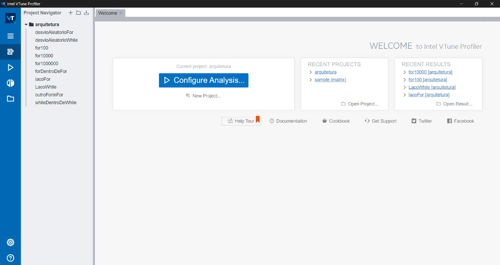
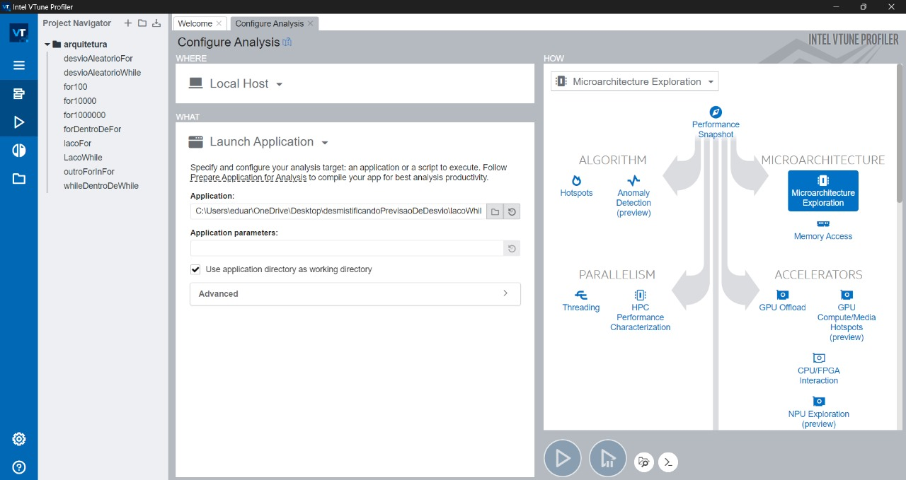
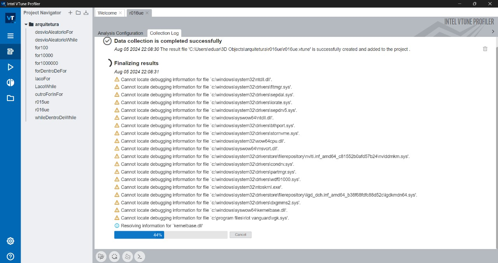
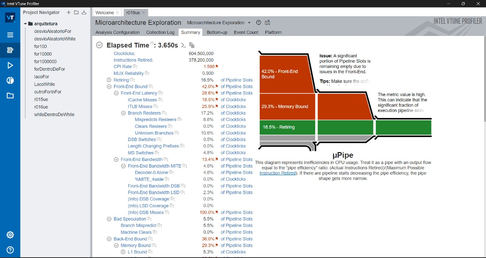

# DesmistificandoPrevisaoDeDesvio
Este repositorio guarda os algoritmos do trabalho da disciplina de arquitetura de computadores da Universidade Federal do Paraná sobre previsões de desvios. O intuito do trabalho é analisar um conjunto de algoritmos e como seus comportamentos influenciam na previsão de desvios feitas pelo processador.

### Material necessário
 Para a execução dos testes, são necessários os arquivos .c aqui incluídos tal como o programa Vtune, para Windows e Linux.

#### Compilação dos programas
Para compilar em arquivos em C, faça gcc -g -O0 nomeDoPrograma.c -o nomeDoPrograma. 

Rode separadamente com ./nomeDoPrograma caso queira 

#### Mexendo na Interfáce do Vtune

Esta é a aba inicial. Inicie em Configure Analysis.

Insira em "Aplication" o caminho para o executavel compilado. Onde se lê Application parameters pode-se deixar em branco. Selecione "Microarchitecture Exploration".

Rodando....

Após o fim dos testes, uma aba é gerada contendo todos os dados. As variáveis de interesse está dentro da seção "Branch Resteers".

